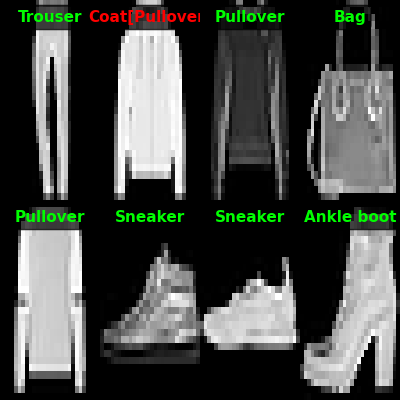
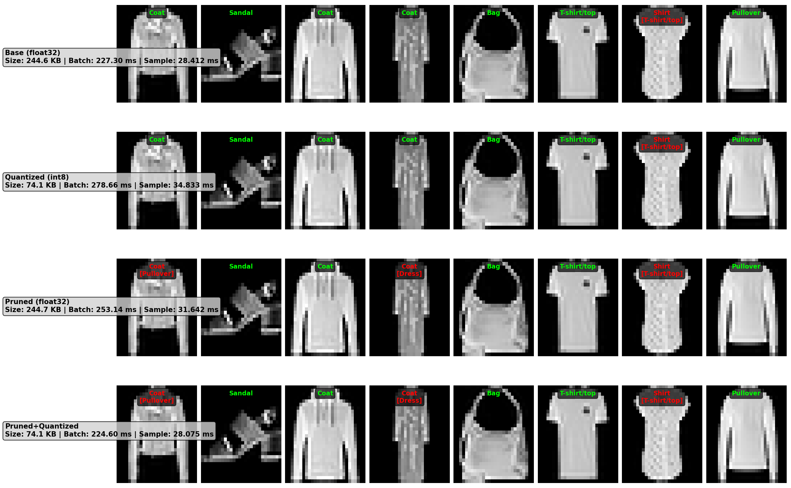

# ESL - LeNet5 Fashion MNIST
---
### ***LeNet5 CNN*** with **pruning** and **quantization** (Fashion MNIST dataset)
---
Mateusz Szczęśniak, Wojciech Minior, Kacper Kamiński
---

## Overview
This project implements LeNet5 architecture trained on Fashion MNIST dataset. The goal is to reduce model size and improve inference speed while maintaining acceptable accuracy by using pruning and quantization.

#### Enviroment
- **GPU** - *GTX 950m (2GB)* 
- **CPU** - *i5-6300HQ @ 2.30GHz*
- **System** - *Ubuntu*
- **Framework** - *PyTorch* 

---

#### Single model inference (base model)

(Green label - correct guess, red label, invalid guess)

#### Comparison


*Time measurements are averages from multiple runs on CPU.

**Important Notes:**
- Structured pruning in PyTorch zeros weights but doesn't physically remove filters from architecture
- No significant speedup from pruning without manual architecture reduction
- Quantization provides size reduction but minimal CPU speedup for small models
- Each compressed model can be optionally retrained for 10 epochs to recover accuracy

### Model Comparison Tool

The project utilities:
- Model size analysis (KB)
- Inference time measurements (ms per batch/sample)
- Accuracy evaluation on test set
- Visual prediction comparison (8 samples per model)
- Compression ratio and speedup statistics
- Generated comparison plots saved to `visuals/`
  


## Setup

Linux/Mac:
```bash
python -m venv .
source bin/activate
pip install torch torchvision numpy pandas matplotlib scikit-learn tqdm tensorboard
```

Windows:
```bash
python -m venv .
.\Scripts\activate
pip install torch torchvision numpy pandas matplotlib scikit-learn tqdm tensorboard
```

## TensorBoard

Training logs:
```bash
tensorboard --logdir=results/final_training_model_log/
```

Hyperparameter tuning logs:
```bash
tensorboard --logdir=results/hparams_tuning_log/
```

---
## Scipt description
- **hparams.py** - Hyperparameters and global directory paths for training and inference
- **dataloader.py** - Reads data from /data and creates datasets for the model
- **hparams_tuning.py** - Hyperparameter tuning (grid search) with TensorBoard logging
- **model.py** - LeNet5 model and helper functions for model analysis and modification
- **inference.py** - Single model inference with 8-sample prediction
- **quant.py** - Runs dynamic quantization
- **prune.py** - Runs structured pruning (pruning parameters in **model.py**)
- **compair_models.py** - Compares all models and generates visualizations
- **train.py** - Trains the model 


Running scripts:
```bash
python script_name.py
```

Available models in `models/` folder.
